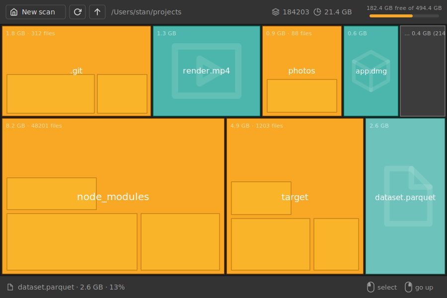

# Filegram

Disk space analyzer with an interactive treemap. Filegram scans a directory
tree and visualizes disk usage as a map of bricks, helping to find what takes
up space.

Built with [Rust](https://www.rust-lang.org/) and [iced](https://iced.rs/).



## Features

- **Interactive treemap** — files and folders are rendered as bricks sized
  proportionally to their disk usage, laid out with a golden-ratio strip
  algorithm; small leftovers are aggregated into a single "rest" brick.
- **Fast parallel scanning** — directory traversal is parallelized with
  [rayon](https://crates.io/crates/rayon); scans can be cancelled at any time.
- **Navigation** — click a folder brick to dive in, go back up, or rescan the
  current directory in place.
- **File actions** — reveal a file in the system file manager or move it to
  the trash (with confirmation) right from the map.
- **Scan history** — recently scanned paths are remembered and offered in the
  path input.
- **Light and dark themes** — follows the system theme automatically.

## Installation

Pre-built binaries are published to the rolling
[latest release](https://github.com/filegram/filegram-desktop/releases/tag/latest):

- **Windows** — x86_64 and i686 (32-bit) executables.
- **macOS** — universal (Intel + Apple Silicon) `.app` bundle in a `.dmg`.
- **Linux (x86_64)** — `.deb`, `.rpm` and AppImage packages, plus a plain binary.

For other platforms, build from source below.

## Building from source

Requires Rust 1.85 or newer.

```sh
cargo build --release
```

The binary is produced at `target/release/filegram`
(`target\release\filegram.exe` on Windows).

On Linux you may need development packages for the windowing stack
(X11/Wayland) — see [.github/workflows/build.yml](.github/workflows/build.yml)
for the exact list used in CI.

### Running tests

```sh
cargo test
```

## License

[MIT](LICENSE)
